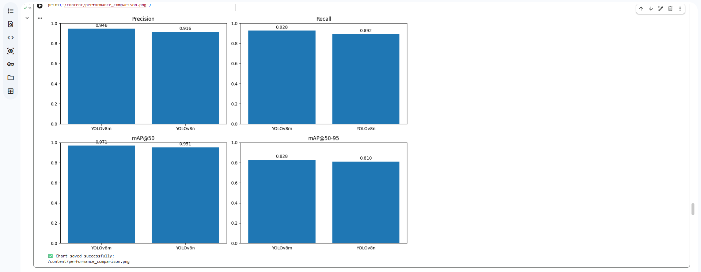

# 🚦 Traffic Sign Detection using YOLOv8

<p align="center">
  <b>Comparative Study of YOLOv8n and YOLOv8m for Traffic Sign Detection</b>
</p>

<p align="center">
  A computer vision project for traffic sign detection, model training, evaluation, and comparative analysis using YOLOv8.
</p>

<p align="center">
  
  
  
  
</p>

---

## 📌 Overview

Traffic sign detection is an important computer vision task with applications in intelligent transportation systems, driver assistance, road monitoring, and autonomous driving.

This project trains and compares two YOLOv8 variants:

- **YOLOv8m (Medium):** larger model with higher capacity and stronger overall detection performance.
- **YOLOv8n (Nano):** lightweight model designed for lower computational requirements.

Both models were trained on the same 15-class traffic sign dataset and evaluated using standard object-detection metrics.

---

## 🎯 Objectives

- Detect and classify traffic signs from images.
- Train YOLOv8 object-detection models on a custom dataset.
- Compare **YOLOv8m** and **YOLOv8n** under the same task.
- Evaluate detection performance using Precision, Recall, mAP@50, and mAP@50–95.
- Analyze class-level detection performance.
- Visualize and compare model results.
- Understand the trade-off between detection performance and model complexity.

---

## 🗂️ Dataset

The project uses the **PKDarabi Car Detection / Traffic Sign Detection dataset** downloaded from Kaggle.

**Dataset identifier:** `pkdarabi/cardetection`

### Dataset Split

| Split | Images |
|---|---:|
| **Training** | **3,530** |
| **Validation** | **801** |
| **Testing** | **638** |

The validation set contains **944 annotated object instances**.

### Classes

The dataset contains **15 traffic-sign classes**:

1. Green Light
2. Red Light
3. Speed Limit 10
4. Speed Limit 100
5. Speed Limit 110
6. Speed Limit 120
7. Speed Limit 20
8. Speed Limit 30
9. Speed Limit 40
10. Speed Limit 50
11. Speed Limit 60
12. Speed Limit 70
13. Speed Limit 80
14. Speed Limit 90
15. Stop

---

## 🔬 Methodology

```text
                 Traffic Sign Dataset
                         │
                         ▼
                Dataset Preparation
                         │
                         ▼
              YOLO Annotation / YAML
                         │
              ┌──────────┴──────────┐
              ▼                     ▼
         YOLOv8n Training      YOLOv8m Training
              │                     │
              └──────────┬──────────┘
                         ▼
                    Validation
                         │
                         ▼
              Performance Evaluation
                         │
                         ▼
                 Model Comparison
                         │
                         ▼
               Test Image Prediction
```

### Experimental Workflow

1. Install the required libraries.
2. Authenticate with Kaggle and download the dataset.
3. Extract and verify the dataset structure.
4. Create the YOLO `data.yaml` configuration.
5. Train YOLOv8m.
6. Validate YOLOv8m.
7. Run predictions on the test set.
8. Train YOLOv8n using the same dataset.
9. Validate YOLOv8n.
10. Run predictions on the test set.
11. Compare the reported performance metrics.
12. Visualize the model comparison.

---

## 🧠 Model Configuration

### YOLOv8m

| Parameter | Value |
|---|---:|
| Model | **YOLOv8m** |
| Epochs | **15** |
| Image Size | **800 × 800** |
| Batch Size | **16** |

### YOLOv8n

| Parameter | Value |
|---|---:|
| Model | **YOLOv8n** |
| Epochs | **15** |
| Image Size | **640 × 640** |
| Batch Size | **16** |

---

## 📊 Performance Results

The following results were obtained from the model validation outputs captured during the experiments.

| Model | Precision | Recall | mAP@50 | mAP@50–95 |
|---|---:|---:|---:|---:|
| **YOLOv8m** | **94.61%** | **92.82%** | **97.06%** | **82.74%** |
| **YOLOv8n** | 91.57% | 89.22% | 95.13% | 81.01% |

### 🏆 Overall Winner: YOLOv8m

YOLOv8m achieved the highest reported value across all four metrics.

| Metric | YOLOv8m Advantage |
|---|---:|
| Precision | **+3.04 percentage points** |
| Recall | **+3.60 percentage points** |
| mAP@50 | **+1.93 percentage points** |
| mAP@50–95 | **+1.73 percentage points** |

> **F1-Score:** The notebook also reports an approximate F1-Score derived from Precision and Recall: **93.7% for YOLOv8m** and **90.5% for YOLOv8n**.

### 📈 Performance Visualization

The project includes a generated comparison chart covering:

- Precision
- Recall
- mAP@50
- mAP@50–95

Place the generated chart at:

```text
assets/performance_comparison.png
```

Then it will render here:



---

## 📈 Evaluation Metrics

### Precision
Measures the proportion of predicted detections that are correct.

### Recall
Measures the proportion of relevant objects successfully detected.

### F1-Score
Provides a combined measure of Precision and Recall.

### mAP@50
Mean Average Precision at an IoU threshold of 0.50.

### mAP@50–95
Mean Average Precision averaged across IoU thresholds from 0.50 to 0.95.

---

## 🔍 Class-Level Analysis

The validation output includes class-level Precision, Recall, and mAP results.

The reported results show particularly strong performance across many speed-limit classes and the **Stop** class, while traffic-light classes such as **Green Light** and **Red Light** are comparatively more challenging.

Selected YOLOv8m validation results include:

| Class | Precision | Recall | mAP@50 |
|---|---:|---:|---:|
| Green Light | 0.866 | 0.791 | 0.879 |
| Red Light | 0.841 | 0.796 | 0.842 |
| Speed Limit 100 | 0.944 | 0.962 | 0.990 |
| Speed Limit 110 | 0.833 | 0.941 | 0.961 |
| Speed Limit 120 | 1.000 | 0.928 | 0.995 |
| Speed Limit 20 | 0.969 | 0.982 | 0.991 |
| Speed Limit 30 | 0.967 | 0.959 | 0.989 |
| Speed Limit 40 | 0.994 | 0.945 | 0.991 |
| Speed Limit 50 | 0.951 | 0.930 | 0.989 |
| Speed Limit 60 | 0.994 | 0.934 | 0.981 |
| Speed Limit 70 | 0.947 | 0.987 | 0.994 |
| Speed Limit 80 | 0.963 | 0.927 | 0.988 |
| Speed Limit 90 | 1.000 | 0.914 | 0.993 |
| Stop | 0.976 | 0.997 | 0.995 |

---

## 🖼️ Test Predictions

The trained models were used to generate predictions on **638 test images**.

Observed examples include:

- **Speed Limit 60** — approximately **0.97 confidence**
- **Speed Limit 40** — approximately **0.97 confidence**
- **Green Light** — approximately **0.87 confidence**
- Additional traffic signs detected in road-scene images.

Recommended location for prediction examples:

```text
assets/
├── prediction_speed_limit_60.png
├── prediction_speed_limit_40.png
└── prediction_traffic_scene.png
```

---

## ⚖️ YOLOv8m vs YOLOv8n

### YOLOv8m

**Advantages**
- Higher Precision
- Higher Recall
- Higher mAP@50
- Higher mAP@50–95
- Stronger overall detection performance

**Trade-off**
- Larger and more computationally demanding.

### YOLOv8n

**Advantages**
- Lightweight architecture
- Lower computational requirements
- Better suited to resource-constrained deployment
- Still provides strong detection performance

**Trade-off**
- Lower reported detection metrics than YOLOv8m.

### Model Complexity

The experiment also recorded approximately:

| Model | Parameters | GFLOPs |
|---|---:|---:|
| **YOLOv8n** | **3.01M** | **8.1** |
| **YOLOv8m** | **25.85M** | **78.7** |

This highlights the practical trade-off between **model capacity, computational cost, and detection performance**.

---

## 🛠️ Tech Stack

| Technology | Purpose |
|---|---|
| **Python 3.12** | Main programming language |
| **Ultralytics YOLOv8** | Object detection |
| **PyTorch** | Deep learning framework |
| **OpenCV** | Image processing |
| **NumPy** | Numerical computation |
| **Matplotlib** | Visualization |
| **Google Colab** | Training and experimentation |
| **Kaggle API** | Dataset acquisition |

### Experimental Environment

- **Ultralytics:** 8.4.115
- **Python:** 3.12.13
- **PyTorch:** 2.11.0+cu128
- **GPU:** NVIDIA Tesla T4
- **CUDA:** enabled

---

## 📁 Repository Structure

```text
traffic-sign-detection-yolov8/
│
├── README.md
├── requirements.txt
├── .gitignore
│
├── notebooks/
│   └── Traffic_Sign_Detection_YOLOv8.ipynb
│
├── models/
│   └── README.md
│
├── results/
│   └── README.md
│
└── assets/
    ├── performance_comparison.png
    ├── prediction_speed_limit_60.png
    ├── prediction_speed_limit_40.png
    └── prediction_traffic_scene.png
```

> The exact filenames may differ from the uploaded notebook. The dataset itself does not need to be committed to GitHub; the repository can document the dataset source and configuration instead.

---

## ⚙️ Dataset Configuration

The YOLO dataset configuration used in the experiment follows this structure:

```yaml
train: /content/car/train/images
val: /content/car/valid/images
test: /content/car/test/images

nc: 15

names:
  [
    'Green Light',
    'Red Light',
    'Speed Limit 10',
    'Speed Limit 100',
    'Speed Limit 110',
    'Speed Limit 120',
    'Speed Limit 20',
    'Speed Limit 30',
    'Speed Limit 40',
    'Speed Limit 50',
    'Speed Limit 60',
    'Speed Limit 70',
    'Speed Limit 80',
    'Speed Limit 90',
    'Stop'
  ]
```

---

## 🚀 Installation & Setup

### 1. Clone the Repository

```bash
git clone https://github.com/mohamednasrgad06-AI/traffic-sign-detection-yolov8.git
cd traffic-sign-detection-yolov8
```

### 2. Install Dependencies

```bash
pip install -r requirements.txt
```

### 3. Open the Notebook

```bash
jupyter notebook
```

The main experiment can also be executed in **Google Colab**.

---

## 🏋️ Training

### YOLOv8m

```python
from ultralytics import YOLO

model_m = YOLO("yolov8m.pt")

model_m.train(
    data="/content/data.yaml",
    epochs=15,
    imgsz=800,
    batch=16,
    name="traffic_sign_detector_m"
)
```

### YOLOv8n

```python
from ultralytics import YOLO

model_n = YOLO("yolov8n.pt")

model_n.train(
    data="/content/data.yaml",
    epochs=15,
    imgsz=640,
    batch=16,
    name="traffic_sign_detector_n"
)
```

---

## 🧪 Validation & Prediction

Validation:

```python
metrics = model.val(data="/content/data.yaml")
```

Test prediction:

```python
results = model.predict(
    source="/content/car/test/images",
    save=True,
    conf=0.25
)
```

The notebook documents the complete training, validation, prediction, and comparison workflow.

---

## 💡 Applications

Traffic sign detection can support:

- 🚗 Advanced Driver Assistance Systems (ADAS)
- 🚘 Autonomous driving
- 🛣️ Intelligent transportation systems
- 📷 Road and traffic monitoring
- 🚦 Traffic management
- 🧠 Computer vision research

---

## ⚠️ Limitations

- The models were trained for **15 epochs**.
- Detection performance varies across classes.
- Traffic-light classes were more challenging than several speed-limit classes.
- YOLOv8m requires substantially more parameters and GFLOPs than YOLOv8n.
- The original training-run `results.png` and confusion-matrix files were not retained in the current Colab runtime, so they are not reconstructed or presented as original training artifacts.

---

## 🔮 Future Work

- Train for more epochs.
- Perform systematic hyperparameter tuning.
- Improve performance on traffic-light classes.
- Add more diverse real-world traffic scenes.
- Evaluate additional YOLOv8 variants.
- Measure real-time FPS and memory consumption.
- Optimize the model for edge devices.
- Deploy the detector in a real-time camera application.
- Compare YOLOv8 against other object-detection architectures.

---

## 📌 Key Takeaway

The experiment demonstrates that both YOLOv8 variants can perform strong traffic-sign detection, with **YOLOv8m achieving the best reported validation performance**.

### YOLOv8m

> **94.61% Precision · 92.82% Recall · 97.06% mAP@50 · 82.74% mAP@50–95**

### YOLOv8n

> **91.57% Precision · 89.22% Recall · 95.13% mAP@50 · 81.01% mAP@50–95**

The results demonstrate a clear trade-off: **YOLOv8m prioritizes detection performance, while YOLOv8n prioritizes a smaller computational footprint.**

---

## 📚 References

1. **Ultralytics YOLO** — YOLOv8 implementation and documentation.
2. **Kaggle** — PKDarabi Car Detection / Traffic Sign Detection Dataset.
3. **OpenCV** — Computer vision and image-processing library.
4. **Matplotlib** — Visualization library.
5. **Google Colab** — Cloud notebook and GPU environment.

---

## 👨‍💻 Author

**Mohamed Nasr Gad**

Artificial Intelligence / Machine Learning

GitHub Repository:

`traffic-sign-detection-yolov8`

---

## 📜 License

This project is intended for educational and research purposes.
