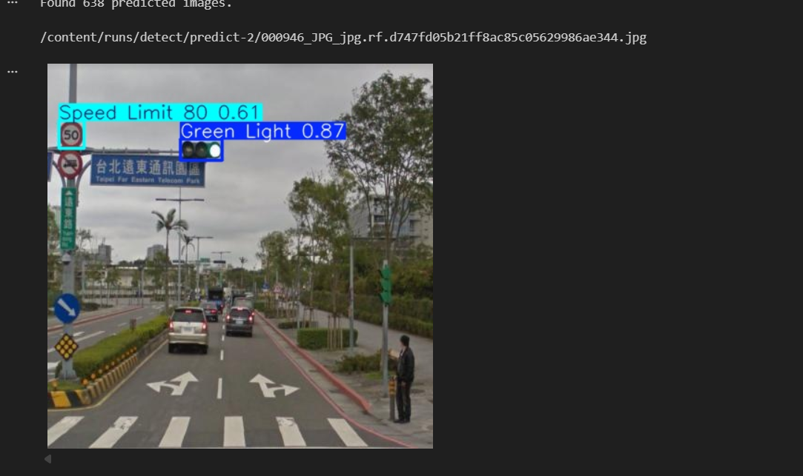
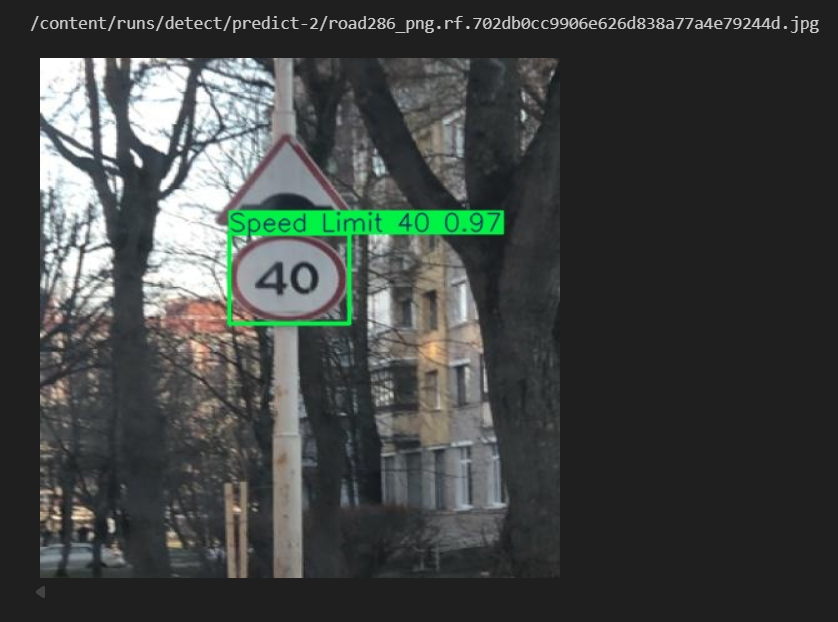
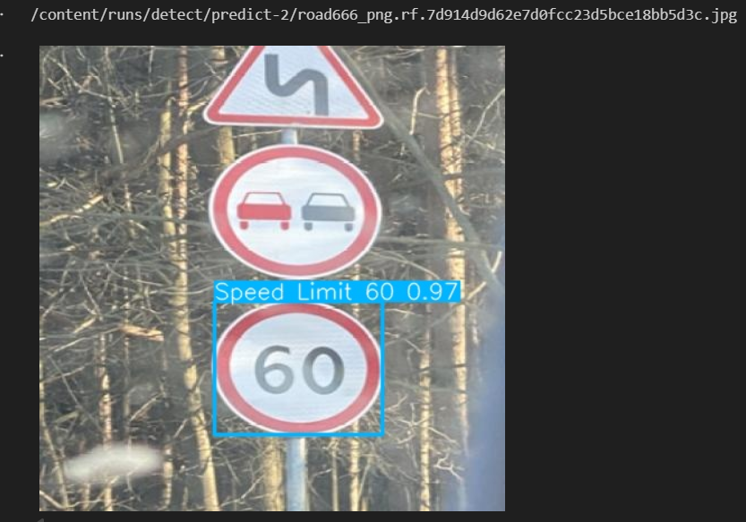

# 🚦 Traffic Sign Detection using YOLOv8

### Comparative Study of YOLOv8n and YOLOv8m for Traffic Sign Detection

A computer vision project for traffic sign detection, model training, evaluation, and comparative analysis using YOLOv8.

---

## 📌 Overview

Traffic sign detection is an important computer vision task with applications in intelligent transportation systems, driver assistance, road monitoring, and autonomous driving.

This project trains and compares two YOLOv8 variants:

- **YOLOv8m (Medium):** Higher model capacity and stronger detection performance.
- **YOLOv8n (Nano):** Lightweight model designed for lower computational requirements.

Both models were trained on the same 15-class traffic sign dataset and evaluated using standard object-detection metrics.

---

## 🎯 Objectives

- Detect and classify traffic signs from images.
- Train YOLOv8 object-detection models on a custom dataset.
- Compare YOLOv8m and YOLOv8n under the same task.
- Evaluate detection performance using Precision, Recall, mAP@50, and mAP@50–95.
- Visualize and compare model results.
- Analyze the trade-off between detection performance and model complexity.

---

## 🗂️ Dataset

The project uses the traffic sign dataset configured in `data.yaml`.

### Dataset Split

| Split | Images |
|---|---:|
| Training | 3,530 |
| Validation | 801 |
| Testing | 638 |

The dataset contains **15 traffic-sign classes**.

### Classes

- Green Light
- Red Light
- Speed Limit 10
- Speed Limit 20
- Speed Limit 30
- Speed Limit 40
- Speed Limit 50
- Speed Limit 60
- Speed Limit 70
- Speed Limit 80
- Speed Limit 90
- Speed Limit 100
- Speed Limit 110
- Speed Limit 120
- Stop

---

## 🔬 Methodology

```text
Traffic Sign Dataset
        │
        ▼
Dataset Preparation
        │
        ▼
YOLO Annotation / YAML
        │
        ├──────────────────┐
        ▼                  ▼
 YOLOv8n Training    YOLOv8m Training
        │                  │
        └────────┬─────────┘
                 ▼
             Validation
                 │
                 ▼
       Performance Evaluation
                 │
                 ▼
          Model Comparison
                 │
                 ▼
        Test Image Prediction
```

---

## 🧪 Experimental Workflow

1. Install the required libraries.
2. Download and prepare the dataset.
3. Extract and verify the dataset structure.
4. Create the YOLO `data.yaml` configuration.
5. Train YOLOv8m.
6. Validate YOLOv8m.
7. Run predictions on test images.
8. Train YOLOv8n using the same dataset.
9. Validate YOLOv8n.
10. Run predictions on test images.
11. Compare model performance.
12. Visualize the results.

---

## 🧠 Model Configuration

### YOLOv8m

| Parameter | Value |
|---|---|
| Model | YOLOv8m |
| Epochs | 15 |
| Image Size | 800 × 800 |
| Batch Size | 16 |

### YOLOv8n

| Parameter | Value |
|---|---|
| Model | YOLOv8n |
| Epochs | 15 |
| Image Size | 640 × 640 |
| Batch Size | 16 |

---

## 📊 Performance Results

| Model | Precision | Recall | mAP@50 | mAP@50–95 |
|---|---:|---:|---:|---:|
| **YOLOv8m** | **94.61%** | **92.82%** | **97.06%** | **82.74%** |
| YOLOv8n | 91.57% | 89.22% | 95.13% | 81.01% |

### 🏆 Overall Winner

**YOLOv8m** achieved the highest reported performance across all four evaluation metrics.

| Metric | YOLOv8m Advantage |
|---|---:|
| Precision | +3.04 percentage points |
| Recall | +3.60 percentage points |
| mAP@50 | +1.93 percentage points |
| mAP@50–95 | +1.73 percentage points |

Approximate F1-scores derived from Precision and Recall:

- YOLOv8m: **93.7%**
- YOLOv8n: **90.5%**

---

## 📈 Performance Comparison


The comparison chart shows Precision, Recall, mAP@50, and mAP@50–95.

---

## 🖼️ Sample Predictions

### Prediction 1



### Prediction 2



### Prediction 3



The trained models successfully detected traffic signs in road-scene images, including speed-limit signs and traffic lights.

---

## 🔍 Class-Level Analysis

The validation results showed strong performance across many speed-limit classes and the Stop class, while traffic-light classes were comparatively more challenging.

Examples from YOLOv8m:

| Class | Precision | Recall | mAP@50 |
|---|---:|---:|---:|
| Green Light | 0.866 | 0.791 | 0.879 |
| Red Light | 0.841 | 0.796 | 0.842 |
| Speed Limit 100 | 0.944 | 0.962 | 0.990 |
| Speed Limit 120 | 1.000 | 0.928 | 0.995 |
| Speed Limit 40 | 0.994 | 0.945 | 0.991 |
| Speed Limit 60 | 0.994 | 0.934 | 0.981 |
| Speed Limit 70 | 0.947 | 0.987 | 0.994 |
| Speed Limit 90 | 1.000 | 0.914 | 0.993 |
| Stop | 0.976 | 0.997 | 0.995 |

---

## ⚖️ YOLOv8m vs YOLOv8n

### YOLOv8m

**Advantages**
- Higher Precision
- Higher Recall
- Higher mAP@50
- Higher mAP@50–95
- Stronger overall detection performance

**Trade-off**
- Larger model
- Higher computational requirements

### YOLOv8n

**Advantages**
- Lightweight architecture
- Lower computational requirements
- Suitable for resource-constrained deployment
- Still provides strong detection performance

**Trade-off**
- Lower reported detection metrics than YOLOv8m

---

## 💻 Model Complexity

| Model | Parameters | GFLOPs |
|---|---:|---:|
| YOLOv8n | 3.01M | 8.1 |
| YOLOv8m | 25.85M | 78.7 |

This demonstrates the practical trade-off between model capacity, computational cost, and detection performance.

---

## 🛠️ Tech Stack

| Technology | Purpose |
|---|---|
| Python 3.12 | Programming language |
| Ultralytics YOLOv8 | Object detection |
| PyTorch | Deep learning framework |
| OpenCV | Image processing |
| NumPy | Numerical computation |
| Matplotlib | Visualization |
| Google Colab | Training and experimentation |
| Kaggle API | Dataset acquisition |

### Experimental Environment

- Ultralytics: 8.4.115
- Python: 3.12.13
- PyTorch: 2.11.0+cu128
- GPU: NVIDIA Tesla T4
- CUDA: Enabled

---

## 📁 Repository Structure

```text
traffic-sign-detection-yolov8/
├── README.md
├── requirements.txt
├── .gitignore
├── notebooks/
│   └── Traffic_Sign_Detection_YOLOv8.ipynb
└── assets/
    ├── performance_comparison.png
    ├── prediction_1.png
    ├── prediction_2.png
    └── prediction_3.png
```

---

## ⚙️ Dataset Configuration

```yaml
train: /content/car/train/images
val: /content/car/valid/images
test: /content/car/test/images

nc: 15
```

---

## 🚀 Installation & Setup

### Clone the Repository

```bash
git clone https://github.com/mohamednasrgad06-AI/traffic-sign-detection-yolov8.git
cd traffic-sign-detection-yolov8
```

### Install Dependencies

```bash
pip install -r requirements.txt
```

### Open the Notebook

```bash
jupyter notebook
```

The experiment can also be executed using Google Colab.

---

## 🏋️ Training

### YOLOv8m

```python
from ultralytics import YOLO

model_m = YOLO("yolov8m.pt")

model_m.train(
    data="/content/data.yaml",
    epochs=15,
    imgsz=800,
    batch=16,
    name="traffic_sign_detector_m"
)
```

### YOLOv8n

```python
from ultralytics import YOLO

model_n = YOLO("yolov8n.pt")

model_n.train(
    data="/content/data.yaml",
    epochs=15,
    imgsz=640,
    batch=16,
    name="traffic_sign_detector_n"
)
```

---

## 🧪 Validation & Prediction

### Validation

```python
metrics = model.val(data="/content/data.yaml")
```

### Test Prediction

```python
results = model.predict(
    source="/content/car/test/images",
    save=True,
    conf=0.25
)
```

---

## 💡 Applications

Traffic sign detection can support:

- 🚗 Advanced Driver Assistance Systems (ADAS)
- 🚘 Autonomous driving
- 🛣️ Intelligent transportation systems
- 📷 Road and traffic monitoring
- 🚦 Traffic management
- 🧠 Computer vision research

---

## ⚠️ Limitations

- The models were trained for 15 epochs.
- Detection performance varies across classes.
- Traffic-light classes were more challenging than several speed-limit classes.
- YOLOv8m requires substantially more parameters and GFLOPs than YOLOv8n.
- Original training-run `results.png` and confusion-matrix files were not retained in the current Colab runtime, so they are not presented as original training artifacts.

---

## 🔮 Future Work

- Train for more epochs.
- Perform systematic hyperparameter tuning.
- Improve performance on traffic-light classes.
- Add more diverse real-world traffic scenes.
- Evaluate additional YOLOv8 variants.
- Measure real-time FPS and memory consumption.
- Optimize the model for edge devices.
- Deploy the detector in a real-time camera application.
- Compare YOLOv8 with other object-detection architectures.

---

## 📌 Key Takeaway

The experiment demonstrates that both YOLOv8 variants can perform strong traffic-sign detection.

**YOLOv8m achieved the best reported validation performance:**

> **94.61% Precision · 92.82% Recall · 97.06% mAP@50 · 82.74% mAP@50–95**

While **YOLOv8n provides a more lightweight alternative:**

> **91.57% Precision · 89.22% Recall · 95.13% mAP@50 · 81.01% mAP@50–95**

Overall, YOLOv8m prioritizes detection performance, while YOLOv8n prioritizes a smaller computational footprint.

---

## 📚 References

- Ultralytics YOLOv8 — Object detection framework and documentation.
- Kaggle — Traffic sign dataset used in the project.
- OpenCV — Computer vision and image-processing library.
- Matplotlib — Visualization library.
- Google Colab — Cloud notebook and GPU environment.

---

## 👨‍💻 Author

**Mohamed Nasr Gad**

Artificial Intelligence / Machine Learning

GitHub Repository: `traffic-sign-detection-yolov8`

---

## 📜 License

This project is intended for educational and research purposes.
